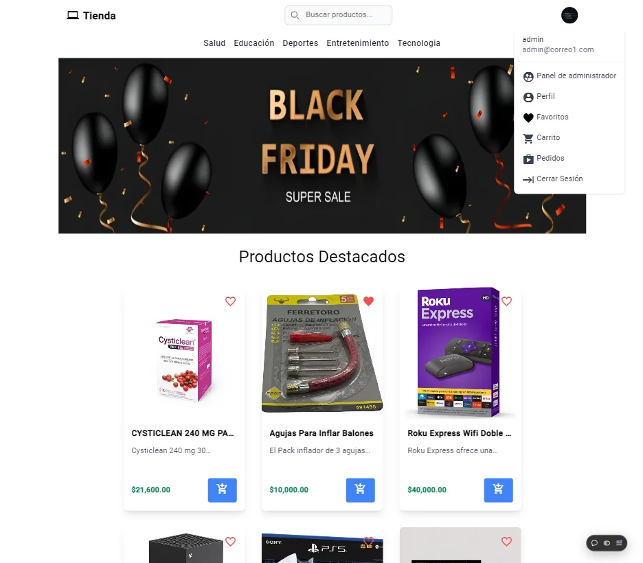
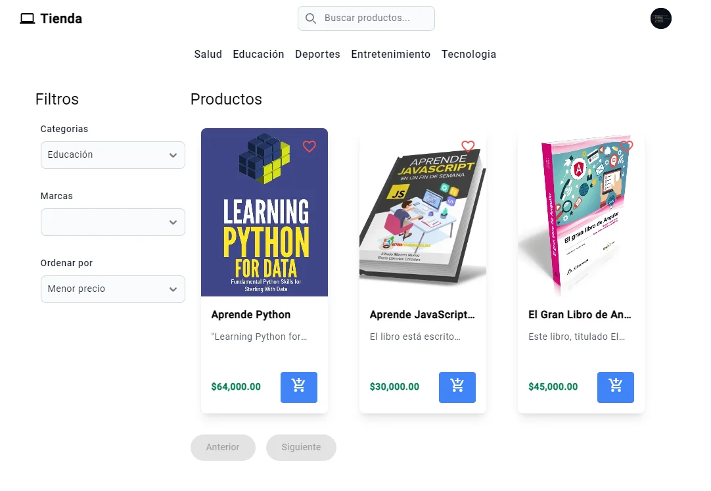
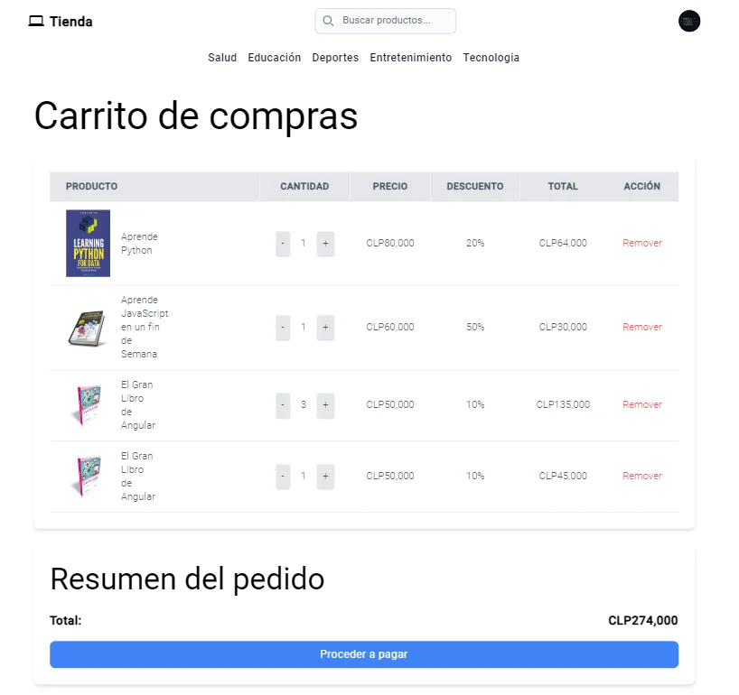
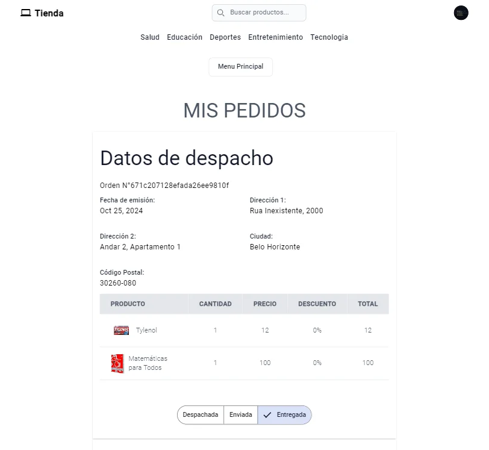
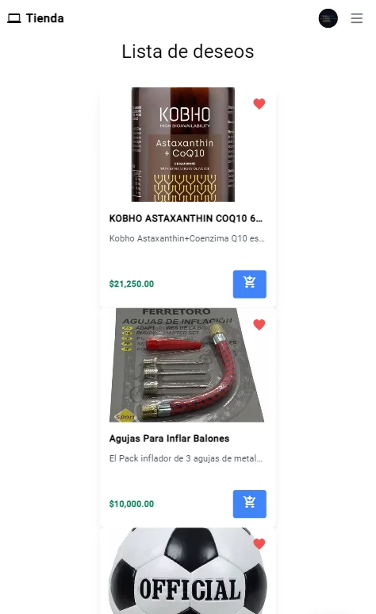
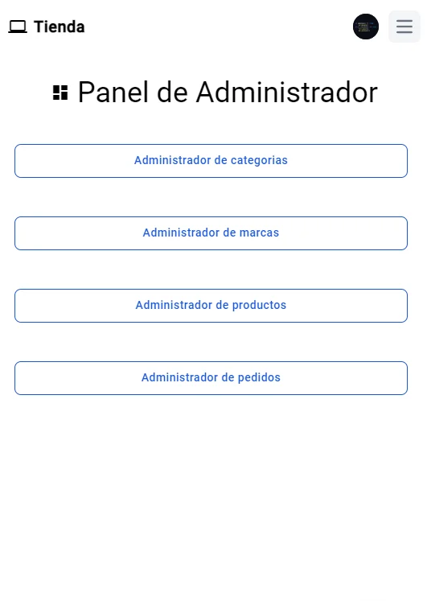

# E-Commerce Frontend

 
 

🌐 [Ver proyecto en línea](https://e-commerce-frontend-teal-one.vercel.app/)

---

## 📖 Descripción

Este proyecto es el **frontend** de un sistema de e-commerce, desarrollado como parte de un proyecto de aprendizaje.  
Implementa características y herramientas modernas para brindar una experiencia de usuario dinámica y responsiva.  

El cliente está desarrollado en **Angular** y consume una API basada en **Node.js**, formando parte del stack **MEAN**.  
Además, incluye un diseño completamente adaptable utilizando **Tailwind CSS**.

---

## 🎯 Características principales

- **Página principal**: Incluye un banner, productos destacados y nuevos.
- **Sistema de filtros**: Filtra productos por categoría y marca.
- **Carrito de compras**: Calcula precios en tiempo real.
- **Lista de deseos**: Guarda productos favoritos.
- **Gestión de pedidos**: Muestra detalles de productos comprados, estado del pedido, y permite administrar órdenes.
- **Panel de administrador**:
  - CRUD para categorías, marcas y productos.
  - Gestión de pedidos: Cambiar estado (Despachado, Enviado, Entregado).
- **Diseño responsivo**: Optimizado para movil, tablet, escritorio.
- **Autenticación**: JWT.

---

## 🛠️ Tecnologías utilizadas

- **Frontend**: Angular 17, TypeScript
- **Estilos**: Tailwind CSS, Angular Material
- **Autenticación**: JSON Web Tokens (JWT)
- **Gestión de estado**: Servicios de Angular
- **Backend**: Node.js, Express, MongoDB  
  [Repositorio del backend](https://github.com/R3dgrave/E-Commerce-Backend)
- **Despliegue**: Vercel (Frontend) y Render (Backend)

---

## 📋 Requisitos previos

Antes de comenzar, asegúrate de tener lo siguiente instalado:

1. [Node.js](https://nodejs.org/) v18 o superior
2. [Angular CLI](https://angular.io/cli)
3. Cuenta en [Vercel](https://vercel.com/) y [Render](https://render.com/) opcional para despliegue.

---

## 🚀 Instalación y configuración

Sigue estos pasos para configurar y ejecutar el proyecto localmente:

1. **Clonar el repositorio**:
   `git clone https://github.com/R3dgrave/E-Commerce-frontend.git`
   `cd E-Commerce-frontend`
2. **Instalar dependencias**:
   `npm install`
2. **Configurar variables de entorno**:
Crea un archivo llamado .env en la raíz del proyecto y define la siguiente variable de entorno:
   `NG_APP_API_URL=https://tubackend-render-url.coml`
2. **Ejecutar el proyecto localmente**:
   `npm start`
   Abre tu navegador y accede a: http://localhost:4200/
   usuario prueba admin: admin@correo1.com / 123456
 
---
## 🛒 Funcionalidades principales
- **Página principal:** 
  Grid responsivo: Muestra productos destacados y nuevos.
  
  

- **Sistema de filtros**
	Filtra productos por categoría o marca.
	Ordena productos por precio.

  
	
- **Carrito de compras**- 
	Agrega o elimina productos del carrito.
	Calcula el precio total automáticamente.

  
	
- **Sección de pedidos**
	Muestra los productos comprados por el cliente.
	incluye detalles como número de orden, fecha de compra y estado del pedido.

  
	
- **Lista de deseos**
	Permite guardar productos favoritos para verlos más tarde.

  
  
- **Panel de administrador**
	Accesible solo con un usuario administrador, incluye:
	Gestión de categorías, marcas y productos (CRUD).
	Gestión de pedidos realizados por los clientes: cambiar el estado de los pedidos (Despachado, Enviado, Entregado).

  
  
	
	---
	
## 🔗 Enlaces útiles
- Backend del proyecto: [E-Commerce Backend](https://github.com/R3dgrave/ECommerce-Backend "E-Commerce Backend")
- Documentación de Angular: https://angular.dev/
- Documentación de Tailwind CSS: https://tailwindcss.com/

	---
	
## 👤 Autor

- Nombre: Diego Abanto Mendoza (R3dgrave)
- Email: r3dgrave98@gmail.com / diego.abantomendoza@gmail.com
- Portafolio: https://portafolio-diegoabanto.vercel.app/
